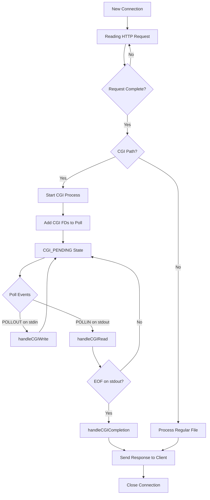

# 🔧 CGI System Technical Documentation: How It All Works

**Date:** October 6, 2025
**Project:** WebServ - C++98 HTTP Server
**Focus:** Complete CGI Architecture & Data Flow

## 📋 Table of Contents
1. [CGI State Structure](#cgi-state-structure)
2. [CGI Detection & Initialization](#cgi-detection--initialization)
3. [Process Creation & Setup](#process-creation--setup)
4. [Poll Integration](#poll-integration)
5. [Main Event Loop & CGI Decision Making](#main-event-loop--cgi-decision-making)
6. [I/O Operations Flow](#io-operations-flow)
7. [Completion & Cleanup](#completion--cleanup)
8. [Data Structures & Mappings](#data-structures--mappings)
9. [Step-by-Step Request Flow](#step-by-step-request-flow)

## 🏗️ CGI State Structure

The heart of our CGI system is the `CgiState` struct that tracks everything:

```cpp
struct CgiState {
    enum State { WRITING, READING };

    // Process Information
    pid_t pid;                    // Child process ID
    time_t start_time;           // When CGI started (for timeouts)

    // File Descriptors
    int stdin_fd;                // Pipe to send data TO CGI (write end)
    int stdout_fd;               // Pipe to read data FROM CGI (read end)

    // Request Data (INPUT to CGI)
    std::string request_body;    // Complete request body to send
    size_t bytes_written;        // How much we've sent so far

    // Response Data (OUTPUT from CGI)
    std::string response_buffer; // CGI output we've collected

    // State Management
    State state;                 // WRITING (sending input) or READING (getting output)
};
```

### 🎯 Purpose of Each Field:
- **`pid`**: Used for waitpid() to check if process finished
- **`start_time`**: Future timeout implementation
- **`stdin_fd`**: Parent writes request body here → CGI reads from stdin
- **`stdout_fd`**: CGI writes response here → Parent reads it
- **`request_body`**: Combined POST data to send to CGI
- **`bytes_written`**: Partial write tracking (non-blocking writes)
- **`response_buffer`**: Accumulates CGI output until complete
- **`state`**: Controls which I/O operations are active

## 🔍 CGI Detection & Initialization

### Step 1: Path Analysis (HttpRequestCGIHelpers.cpp)
```cpp
bool HttpRequest::isCGIPath(const std::string& path) {
    // Check if path ends with .py, .php, .pl, etc.
    // Also check if file exists and is executable
}
```

### Step 2: Environment Setup
```cpp
void HttpRequest::initEnv() {
    // Calculate CONTENT_LENGTH from actual body data:
    size_t totalLength = 0;
    for (body_map::iterator it = _body.begin(); it != _body.end(); ++it) {
        totalLength += it->second.size();
    }

    // Set environment variables:
    _env["CONTENT_LENGTH"] = toString(totalLength);
    _env["REQUEST_METHOD"] = _method;
    _env["SCRIPT_NAME"] = _path;
    // ... more CGI environment variables
}
```

### Step 3: CGI Handler Activation
```cpp
void HttpRequest::cgiHandler() {
    initEnv();                    // Setup environment
    _cgiState = new CgiState();   // Allocate state structure
    _status = CGI_PENDING;        // Mark request as waiting for CGI
    executeBin();                 // Fork and execute CGI process
}
```

## 🚀 Process Creation & Setup

The `executeBin()` function handles the critical fork/exec dance:

### Step 1: Create Communication Pipes
```cpp
int stdin_fd[2];   // stdin_fd[0] = read end, stdin_fd[1] = write end
int stdout_fd[2];  // stdout_fd[0] = read end, stdout_fd[1] = write end

if (pipe(stdin_fd) < 0 || pipe(stdout_fd) < 0) {
    // Handle pipe creation failure
}

// CRITICAL: Set parent-side FDs to non-blocking
fcntl(stdin_fd[1], F_SETFL, O_NONBLOCK);   // Parent writes here
fcntl(stdout_fd[0], F_SETFL, O_NONBLOCK);  // Parent reads here
```

### Step 2: Fork Process
```cpp
pid_t pid = fork();

if (pid == 0) {
    // CHILD PROCESS: Become the CGI script
    childHandler(stdin_fd, stdout_fd);
} else if (pid > 0) {
    // PARENT PROCESS: Manage I/O with child
    parentHandler(stdin_fd, stdout_fd, pid);
}
```

### Step 3: Child Process Setup (childHandler)
```cpp
void HttpRequest::childHandler(int stdin_fd[2], int stdout_fd[2]) {
    // Redirect stdin/stdout to pipes
    dup2(stdin_fd[0], STDIN_FILENO);   // CGI reads from pipe
    dup2(stdout_fd[1], STDOUT_FILENO); // CGI writes to pipe

    // Close all pipe ends (child doesn't need them)
    close(stdin_fd[0]); close(stdin_fd[1]);
    close(stdout_fd[0]); close(stdout_fd[1]);

    // Execute the CGI script
    char** argv = getArgvArray();  // ["/usr/bin/python3", "script.py"]
    char** envp = getEnvArray();   // ["CONTENT_LENGTH=123", "REQUEST_METHOD=POST", ...]

    execve(argv[0], argv, envp);   // Replace process with CGI script
    exit(1);                       // Only reached if execve fails
}
```

### Step 4: Parent Process Setup (parentHandler)
```cpp
void HttpRequest::parentHandler(int stdin_fd[2], int stdout_fd[2], pid_t pid) {
    // Store process information
    _cgiState->pid = pid;
    _cgiState->stdin_fd = stdin_fd[1];   // Parent writes here
    _cgiState->stdout_fd = stdout_fd[0]; // Parent reads here
    _cgiState->start_time = time(NULL);

    // Close child-side pipe ends
    close(stdin_fd[0]);  // Child's stdin read end
    close(stdout_fd[1]); // Child's stdout write end

    // Prepare request body for transmission
    if (!_body.empty()) {
        // Combine all body parts
        _cgiState->request_body = "";
        for (body_map::iterator it = _body.begin(); it != _body.end(); ++it) {
            _cgiState->request_body += it->second;
        }
        _cgiState->bytes_written = 0;
        _cgiState->state = CgiState::WRITING;  // Start in write mode
    } else {
        // No body to send, go straight to reading
        close(_cgiState->stdin_fd);
        _cgiState->stdin_fd = -1;
        _cgiState->state = CgiState::READING;
    }
}
```

## 🔌 Poll Integration

After process creation, the CGI FDs are added to the main server poll array:

```cpp
void Webserv::addCGIToPoll(int clientFd) {
    CgiState* cgiState = _clients[clientFd]->httpReq->getCGIState();

    // Always add stdout for reading CGI response
    struct pollfd stdout_pollfd = {cgiState->stdout_fd, POLLIN, 0};
    _pollFds.push_back(stdout_pollfd);
    _cgiToClient[cgiState->stdout_fd] = clientFd;  // Map FD → client

    // Add stdin only if we need to write request body
    if (cgiState->state == CgiState::WRITING && cgiState->stdin_fd != -1) {
        struct pollfd stdin_pollfd = {cgiState->stdin_fd, POLLOUT, 0};
        _pollFds.push_back(stdin_pollfd);
        _cgiToClient[cgiState->stdin_fd] = clientFd;  // Map FD → client
    }
}
```

**Data Structures:**
- `_pollFds`: Vector of pollfd structs for poll() system call
- `_cgiToClient`: Map from CGI file descriptor to client socket FD

## 🎛️ Main Event Loop & CGI Decision Making

The heart of the server is the `connectAndRead()` function in `WebservRunner.cpp`. This is where the server decides whether to handle regular HTTP requests or CGI operations based on file descriptor analysis.

### Main Poll Loop Structure
```cpp
int Webserv::connectAndRead() {
    // Poll all file descriptors for events
    int ready = poll(&_pollFds[0], _pollFds.size(), POLL_TIMEOUT);

    if (ready <= 0) return 1; // Timeout or error

    // Iterate through all ready file descriptors
    for (std::vector<struct pollfd>::iterator it = _pollFds.begin();
         it != _pollFds.end(); ++it) {

        if (it->fd == -1) continue; // Skip closed FDs

        short events = it->revents;
        if (events == 0) continue; // No events on this FD

        // DECISION POINT: What type of FD is this?
        if (isServerSocket(it->fd)) {
            // Server socket: accept new connection
            acceptNewConnection(it->fd);
        }
        else if (isCGIFileDescriptor(it->fd)) {
            // CGI FD: handle CGI I/O operations
            int status = handleCGIEvents(it, events);
            if (status == -1) break; // Iterator invalidated
        }
        else {
            // Client socket: handle HTTP request/response
            readDataFromSocket(it);
        }
    }
    return 1;
}
```

### CGI File Descriptor Detection
The crucial decision is made by checking if an FD belongs to a CGI process:

```cpp
bool isCGIFileDescriptor(int fd) {
    // Check if this FD is in our CGI-to-client mapping
    return (_cgiToClient.find(fd) != _cgiToClient.end());
}
```

**How CGI FDs get into `_cgiToClient`:**
1. When `addCGIToPoll()` is called during CGI startup
2. Both `stdin_fd` and `stdout_fd` are mapped to the client FD
3. The poll loop can then identify these as CGI operations

### CGI Event Handler Dispatcher
```cpp
int Webserv::handleCGIEvents(std::vector<struct pollfd>::iterator &it, short events) {
    // Get the client associated with this CGI FD
    int clientFd = _cgiToClient[it->fd];
    CgiState* cgiState = _clients[clientFd]->httpReq->getCGIState();

    // Dispatch based on FD type and event type
    if (it->fd == cgiState->stdin_fd && (events & POLLOUT)) {
        // CGI stdin ready for writing (send request body)
        handleCGIWrite(clientFd, cgiState);
    }
    else if (it->fd == cgiState->stdout_fd && (events & POLLIN)) {
        // CGI stdout ready for reading (receive response)
        handleCGIRead(clientFd, cgiState);
    }

    ++it; // Move to next FD
    return 1;
}
```

### When Does a Request Become CGI?

The decision happens in the **regular HTTP processing flow**:

```cpp
int Webserv::readDataFromSocket(std::vector<struct pollfd>::iterator &it) {
    int clientFd = it->fd;

    // Read HTTP request data from client
    // ... (request parsing logic)

    // After complete request is received:
    if (_clients[clientFd]->httpReq->isComplete()) {
        // Parse the request path
        std::string path = _clients[clientFd]->httpReq->getPath();

        // CRITICAL DECISION POINT: Is this a CGI request?
        if (_clients[clientFd]->httpReq->isCGIPath(path)) {
            // YES: Start CGI processing
            _clients[clientFd]->httpReq->cgiHandler();

            // Add CGI FDs to poll array
            addCGIToPoll(clientFd);

            // Request status is now CGI_PENDING
            // Future poll cycles will handle CGI I/O
        } else {
            // NO: Handle as regular file request
            processAndSendResponse(clientFd);
        }
    }

    return 1;
}
```

### CGI Path Detection Logic
```cpp
bool HttpRequest::isCGIPath(const std::string& path) {
    // Check file extension
    if (path.find(".py") != std::string::npos ||
        path.find(".php") != std::string::npos ||
        path.find(".pl") != std::string::npos) {

        // Verify file exists and is executable
        std::string fullPath = _config->getRoot() + path;
        struct stat fileStat;
        if (stat(fullPath.c_str(), &fileStat) == 0) {
            return (fileStat.st_mode & S_IXUSR); // Executable by user
        }
    }
    return false;
}
```

### State Transitions in the Event Loop

Here's how a client connection transitions through states:



### Timeline Example: CGI vs Regular Request

**Regular File Request:**
```
T+0: Client connects → FD added to poll
T+1: HTTP request received → readDataFromSocket()
T+2: isCGIPath() returns false → processAndSendResponse()
T+3: File content sent → connection closed
```

**CGI Request:**
```
T+0: Client connects → FD added to poll
T+1: HTTP request received → readDataFromSocket()
T+2: isCGIPath() returns true → cgiHandler()
T+3: CGI process forked → CGI FDs added to poll
T+4: Poll detects CGI stdout ready → handleCGIRead()
T+5: CGI process exits → handleCGICompletion()
T+6: Response sent → connection closed
```

### Key Decision Points Summary

1. **FD Type Recognition**: `_cgiToClient.find(fd)` determines if FD belongs to CGI
2. **Path Analysis**: `isCGIPath()` decides if request should use CGI
3. **Event Dispatching**: Event type (POLLIN/POLLOUT) determines CGI operation
4. **State Management**: `CgiState::state` controls which operations are active

This architecture allows the server to seamlessly handle both regular HTTP requests and CGI requests in the same event loop, with clear decision points that determine the processing path! 🎯

## 🔄 I/O Operations Flow

The main server poll loop detects when CGI FDs are ready and calls handlers:

### Writing to CGI (Sending request body):
```cpp
void Webserv::handleCGIWrite(int clientFd, CgiState *cgiState) {
    size_t remaining = cgiState->request_body.size() - cgiState->bytes_written;

    if (remaining <= 0) {
        // Finished sending body
        closeCGIStdin(cgiState);  // Close stdin, switch to READING state
        return;
    }

    // Try to write more data (NON-BLOCKING)
    ssize_t written = write(cgiState->stdin_fd,
                           cgiState->request_body.c_str() + cgiState->bytes_written,
                           remaining);

    if (written > 0) {
        // Success: update progress
        cgiState->bytes_written += written;
        if (cgiState->bytes_written >= cgiState->request_body.size()) {
            closeCGIStdin(cgiState);  // Finished sending
        }
    } else {
        // Error (including EAGAIN/EWOULDBLOCK): cleanup
        _clients[clientFd]->httpReq->setStatus(INTERNAL_ERROR);
        cleanupCGI(clientFd, cgiState);
        processAndSendResponse(clientFd);
    }
}
```

### Reading from CGI (Receiving response):
```cpp
void Webserv::handleCGIRead(int clientFd, CgiState *cgiState) {
    char buffer[4096];
    ssize_t bytesRead = read(cgiState->stdout_fd, buffer, sizeof(buffer));

    if (bytesRead > 0) {
        // Success: accumulate response data
        cgiState->response_buffer.append(buffer, bytesRead);
    } else if (bytesRead == 0) {
        // EOF: CGI finished writing, close stdout
        close(cgiState->stdout_fd);
        cgiState->stdout_fd = -1;
        handleCGICompletion(clientFd, cgiState);  // Check if process done
    } else {
        // Error: cleanup immediately
        _clients[clientFd]->httpReq->setStatus(INTERNAL_ERROR);
        cleanupCGI(clientFd, cgiState);
        processAndSendResponse(clientFd);
    }
}
```

## 🏁 Completion & Cleanup

Process completion is checked when stdout reaches EOF:

```cpp
void Webserv::handleCGICompletion(int clientFd, CgiState *cgiState) {
    int status;
    pid_t result = waitpid(cgiState->pid, &status, WNOHANG);  // Non-blocking check

    if (result == cgiState->pid) {
        // Process finished
        if (WIFEXITED(status) && WEXITSTATUS(status) == 0) {
            // Success: use CGI output as response
            _clients[clientFd]->httpReq->setCGIResult(cgiState->response_buffer);
            _clients[clientFd]->httpReq->setStatus(OK);
        } else {
            // CGI script failed
            _clients[clientFd]->httpReq->setStatus(INTERNAL_ERROR);
        }

        cleanupCGI(clientFd, cgiState);
        processAndSendResponse(clientFd);  // Send response to client
    } else if (result == -1) {
        // waitpid() error
        _clients[clientFd]->httpReq->setStatus(INTERNAL_ERROR);
        cleanupCGI(clientFd, cgiState);
        processAndSendResponse(clientFd);
    }
    // result == 0 means process still running, check again later
}
```

### Complete cleanup process:
```cpp
void Webserv::cleanupCGI(int clientFd, CgiState *cgiState) {
    // Close and remove file descriptors
    if (cgiState->stdin_fd != -1) {
        close(cgiState->stdin_fd);
        removeFdFromPoll(cgiState->stdin_fd);
    }
    if (cgiState->stdout_fd != -1) {
        close(cgiState->stdout_fd);
        removeFdFromPoll(cgiState->stdout_fd);
    }

    // Terminate process if still running
    if (cgiState->pid > 0) {
        kill(cgiState->pid, SIGTERM);    // Ask nicely
        waitpid(cgiState->pid, NULL, 0); // Wait for termination
    }

    // Free memory
    delete cgiState;
    _clients[clientFd]->httpReq->setCGIState(NULL);
}
```

## 📊 Data Structures & Mappings

Key data structures in Webserv class:

```cpp
class Webserv {
    std::vector<struct pollfd> _pollFds;        // All FDs for poll()
    std::map<int, Client*> _clients;            // clientFd → Client object
    std::map<int, int> _cgiToClient;            // cgiFd → clientFd mapping

    // CGI FDs are added to _pollFds with events:
    // - stdin_fd with POLLOUT (ready for writing)
    // - stdout_fd with POLLIN (ready for reading)
};
```

### Mapping Relationships:
```
Client Socket FD (8) ←→ Client Object
                    ↓
                HttpRequest Object
                    ↓
                CgiState Object
                    ↓
    stdin_fd(10) ←→ clientFd(8) [via _cgiToClient]
    stdout_fd(11) ←→ clientFd(8) [via _cgiToClient]
```

## 🔄 Step-by-Step Request Flow Example

Let's trace a POST request to a Python CGI script:

### Step 1: Request Arrives
```http
POST /cgi/upload.py HTTP/1.1
Content-Length: 100
Content-Type: application/x-www-form-urlencoded

name=john&file=data123...
```

### Step 2: CGI Detection
- `isCGIPath("/cgi/upload.py")` returns true
- `cgiHandler()` is called instead of regular file serving

### Step 3: Process Creation
- `executeBin()` creates pipes: stdin_fd[10,11], stdout_fd[12,13]
- Sets FDs 11,12 to non-blocking (parent side)
- `fork()` creates child process
- **Child:** `execve("/usr/bin/python3", ["python3", "upload.py"], env)`
- **Parent:** Stores pid, FDs 11(write), 12(read) in CgiState

### Step 4: Poll Integration
- Add stdout_fd(12) with POLLIN to _pollFds
- Add stdin_fd(11) with POLLOUT to _pollFds
- Map 11→clientFd, 12→clientFd in _cgiToClient

### Step 5: Request Body Transmission
- poll() detects stdin_fd(11) ready for writing
- `handleCGIWrite()` sends "name=john&file=data123..." to pipe
- Multiple calls until all bytes written
- Close stdin_fd, remove from poll, switch to READING state

### Step 6: Response Collection
- Python script processes input, writes to stdout
- poll() detects stdout_fd(12) has data (POLLIN)
- `handleCGIRead()` reads chunks into response_buffer
- Continues until EOF (Python script exits)

### Step 7: Completion
- `handleCGICompletion()` calls waitpid() → process finished
- CGI output becomes HTTP response body
- `cleanupCGI()` closes FDs, kills process, frees memory
- `processAndSendResponse()` sends HTTP response to client

### Final Timeline:
| Time | Event |
|------|-------|
| T+0ms | Client connects, sends POST request |
| T+1ms | CGI detected, process forked |
| T+2ms | FDs added to poll array |
| T+3-10ms | Request body written to CGI (multiple poll cycles) |
| T+11ms | CGI stdin closed, script starts processing |
| T+50ms | CGI writes response, poll detects POLLIN |
| T+51-60ms | Response read from CGI (multiple poll cycles) |
| T+61ms | CGI exits, process reaped |
| T+62ms | HTTP response sent to client |
| T+63ms | Connection closed, memory freed |

## 🎯 Key Insights

1. **Asynchronous Nature**: No blocking operations - server handles other clients during CGI processing

2. **State Machine**: CgiState tracks WRITING→READING→COMPLETION transitions

3. **File Descriptor Management**: Careful mapping between CGI FDs and client connections

4. **Error Handling**: Any I/O failure triggers immediate cleanup (fail-fast approach)

5. **Memory Safety**: Structured cleanup prevents leaks and zombie processes

6. **Standards Compliance**: Full CGI environment variables, proper process lifecycle

This architecture allows WebServ to handle multiple concurrent CGI requests efficiently while maintaining server responsiveness and reliability! 🚀